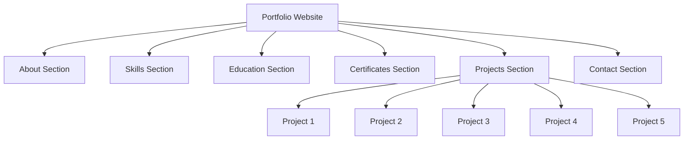

# Luke Ponga - Software Developer Portfolio


A modern, responsive portfolio website showcasing Luke Ponga's skills, projects, and professional experience as a software developer specializing in IoT and AI.

## Features

- **Modern UI Design**: Clean, professional aesthetic with smooth animations
- **Fully Responsive**: Works on all device sizes from mobile to desktop
- **Interactive Elements**: Hover effects, smooth scrolling, and animations
- **Project Showcase**: Highlighted projects with technology tags
- **Skills Display**: Organized into development, soft skills, and technical categories
- **Education Timeline**: Visual representation of educational background
- **Contact Section**: Easy ways to get in touch

## Technologies Used

- **Frontend**:
  - HTML5
  - CSS3 (with custom variables and animations)
  - JavaScript (ES6+)
  - Bootstrap 5 (for responsive components)
  - Bootstrap Icons
  - Google Fonts (Poppins and Inter)

## Project Structure

```
portfolio/
├── index.html              # Main HTML file
├── styles.css              # Custom CSS styles
├── script.js               # JavaScript functionality
├── images/                 # Project screenshots
│   ├── new-zealand-website-screenshot.jpg
│   ├── doctors-appointments-screenshot.jpg
│   ├── health-clinic-mvc-screenshot.jpg
│   ├── vehicle-api-screenshot.jpg
│   └── crypto-currency-stats-screenshot.jpg
└── certificates/           # Certificate images
    └── certificate.png
```

## Getting Started

To run this project locally:

1. Clone the repository:
   ```bash
   git clone https://github.com/lukeponga-dev/lukeponga-dev.github.io
   ```

2. Navigate to the project directory:
   ```bash
   cd lukeponga-dev.github.io
   ```

3. Open `index.html` in your browser

## Customization Guide

### Update Content
1. Modify text content in `index.html`
2. Replace placeholder images in the `images/` folder
3. Update certificate in the `certificates/` folder

### Change Colors
Modify CSS variables in `styles.css`:
```css
:root {
  --primary: #4361ee;
  --primary-dark: #3a56d4;
  --secondary: #7209b7;
  --dark: #1e2a47;
  --light: #f8f9fa;
  --accent: #4895ef;
  --text: #2d3748;
  --text-light: #718096;
  --card-bg: #ffffff;
}
```

### Add Projects
Use the following template to add new projects:
```html
<div class="col-md-6 col-lg-4">
  <div class="project-card card">
    
    <div class="card-body">
      <h3 class="project-card__title">Project Name</h3>
      <p class="project-card__description">Project description</p>
      <div class="project-card__links">
        <a href="#" class="btn btn-primary me-2 mb-2">Live Demo</a>
        <a href="#" class="btn btn-outline-secondary mb-2">Source Code</a>
      </div>
      <div class="mt-3">
        <span class="tech-badge">Technology 1</span>
        <span class="tech-badge">Technology 2</span>
      </div>
    </div>
  </div>
</div>
```

## Deployment

### GitHub Pages
1. Commit and push changes to your repository
2. Go to repository Settings → Pages
3. Select branch and folder (usually `main` and `/` root)
4. Your site will be live at: `https://<username>.github.io/<repository>`

### Custom Domain (Optional)
1. Add a `CNAME` file to your repository with your domain name
2. Configure DNS settings with your domain provider

## License

This project is licensed under the MIT License. See the [LICENSE](LICENSE) file for details.

## Contact

**Luke Ponga**  
Software Developer  
Hamilton, New Zealand  

- Email: [lukeponga9@gmail.com](mailto:lukeponga9@gmail.com)
- LinkedIn: [linkedin.com/in/lukeponga](https://linkedin.com/in/lukeponga)
- GitHub: [github.com/lukeponga-dev](https://github.com/lukeponga-dev)

---


